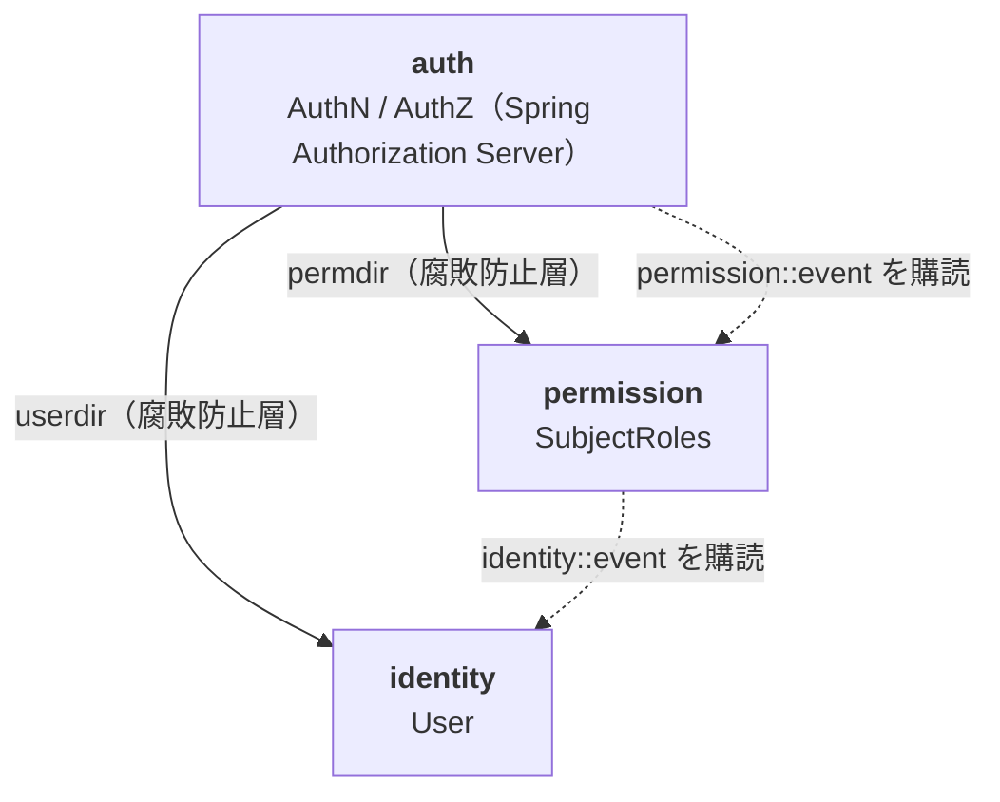

# アーキテクチャ

このドキュメントは全体の設計方針だけを扱う。各モジュールの中身は [modules/](modules) 配下、テストは [testing.md](testing.md)。

## 全体像

1 つのデプロイ単位（モジュラーモノリス）の中に 3 つのモジュールを置く。

実線 = API 呼び出し、点線 = イベント購読。

| モジュール   | 責務                                                 | ドキュメント                                   |
|--------------|------------------------------------------------------|------------------------------------------------|
| `auth`       | 認証・認可。Spring Authorization Server の設定と拡張 | [modules/auth.md](modules/auth.md)             |
| `identity`   | ユーザーの識別情報とライフサイクル                   | [modules/identity.md](modules/identity.md)     |
| `permission` | role / permission と subject への割り当て            | [modules/permission.md](modules/permission.md) |

矢印の向きが依存の向き。`identity` と `permission` は互いを知らず、`auth` だけが両方を知る。

## 設計の柱

### 1. モジュール分割は「強制」する

Spring Modulith を使い、モジュール間の依存を `package-info.java` の
`@ApplicationModule(allowedDependencies = ...)` で宣言する。宣言に無い依存は `ModulithTest` で落ちる。

> **なぜ**：package で分けただけの「モジュール化」は、時間が経つと必ず境界が曖昧になる。

### 2. モジュール内は DDD + Clean Architecture + CQRS

`identity` / `permission` モジュール は次のレイヤー構成に従う。

| レイヤー        | 内容                                                              | 依存                  |
|-----------------|-------------------------------------------------------------------|-----------------------|
| domain/         | アグリゲート・値オブジェクト・Repository port・Factory・ErrorCode | 何にも依存しない      |
| application/    | CommandService / QueryService                                     | domain に依存         |
| infrastructure/ | jOOQ による Repository 実装、イベントリスナー                     | domain の port を実装 |
| presentation/   | Controller、Request / Response                                    | application を呼ぶ    |

- ドメインのオブジェクトは、jMolecules のアノテーションで明示する。例：アグリゲートルート: `@AggregateRoot`、値オブジェクト: `@ValueObject`
- アグリゲートの形はテーブルではなくドメインで決める。永続化は `snapshot` → Factory で再構築
- アプリケーションが投げる例外は `BusinessException` / `SystemException` に限定

`auth` モジュールは Spring Authorization Server に合わせて作る側なので例外とし、このレイヤー構成を適用しない。
`jwk` / `login` / `server` / `userdir` / `permdir` などの機能単位で分ける。

> **なぜ**：DDD と Clean Architecture はこのプロジェクトの学習テーマ。
> 今の複雑さに対してはオーバーエンジニアリングだが、それは承知の上で実践することを優先した。

### 3. モジュール間の連携

モジュールが外に見せるものは 2 種類に限る。

| 種類     | 宣言                                            | 用途                                                                                            |
|----------|-------------------------------------------------|-------------------------------------------------------------------------------------------------|
| API      | `api/` パッケージ、`@NamedInterface("api")`     | 同期呼び出し。呼ぶ側は腐敗防止層（`auth.userdir` / `auth.permdir`）で包む                       |
| イベント | `event/` パッケージ、`@NamedInterface("event")` | 非同期通知。Spring Modulith のイベント発行（`common.event_publication` に永続化、AFTER_COMMIT） |

- API は「相手が必要とする形」で作る（`identity.api.auth` は auth 専用の窓口）
- 呼ぶ側は相手の型を自分の中に持ち込まない。`XxxDirectory` で変換する
- 状態の変化を他モジュールに伝えるのはイベント。呼び出しを連鎖させて伝えない

### 4. 永続化は jOOQ、スキーマは SQL を正とする

- スキーマの正（single source of truth）は `docker/postgres/init/01_schema.sql`。compose・jOOQ コード生成・統合テストが同じ SQL を使う
- jOOQ の生成コードはバージョン管理しない（`compileJava` 前に Testcontainers で使い捨て DB を起動して生成）
- スキーマはモジュール単位（`auth` / `identity` / `permission` / `common`）
- Redis は認可コード・token・session など、寿命の短いもの専用

## 設定

- `application.yml`：環境に依存しない設定のみ
- `application-local.yml`：ローカル開発用
