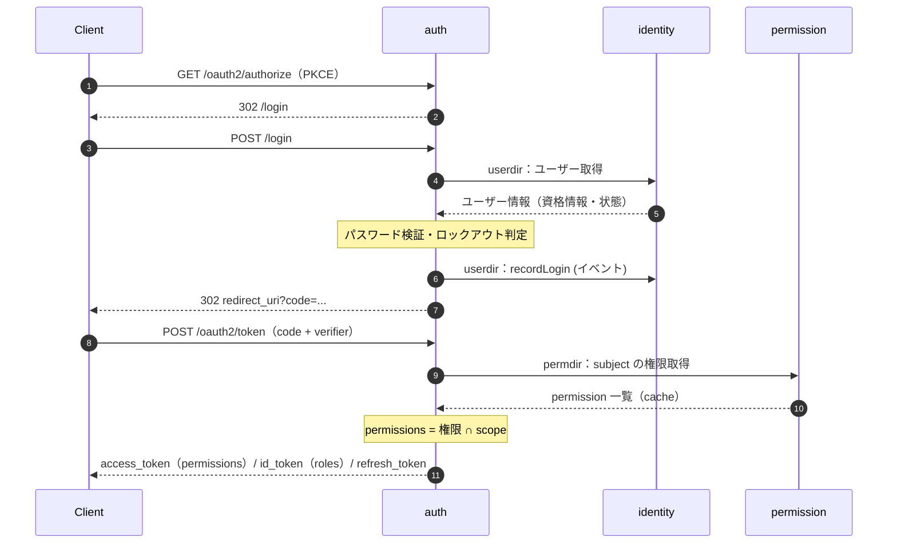

# auth モジュール

認証（ログイン）と認可（OAuth 2.1 / OIDC）を担当する。
認可処理は Spring Authorization Server（SAS）で実現する。

```
auth/
├── config/     Security filter chain（SAS 用 / ログイン用）、SAS の設定など
├── server/     SAS のフック実装
├── jwk/        トークン署名用 JWK の管理
├── login/      ログイン画面、認証 provider、ロックアウト
├── userdir/    identity::api の腐敗防止層
├── permdir/    permission::api の腐敗防止層
└── shared/     モジュール内の共通処理
```

依存：`identity::api` `identity::event` `permission::api` `permission::event`

## エンドポイント

OAuth2 / OIDC の各エンドポイントは SAS の既定パス（`/oauth2/authorize` `/oauth2/token` `/oauth2/revoke` `/userinfo` `/connect/logout` `/.well-known/*` 等）。
ログイン画面は `/login`。

対応するフロー：Authorization Code + PKCE、Refresh Token、Client Credentials。



## Filter chain

| chain                | 対象                 | 認証                                       |
|----------------------|----------------------|--------------------------------------------|
| Authorization Server | SAS のエンドポイント | SAS の既定                                 |
| Authentication       | `/login`             | form login（`AuthenticationProviderImpl`） |

※ `/api/**` `/actuator/**` の Resource chain と既定の chain は `config/security`（モジュール外）にある。

## Token

- access token：`permissions` claim = subject に付与された permission ∩ client が要求した scope。`roles` は載せない
- id_token：`roles`（表示用）+ profile / email 系の claim
- claim の組み立ては `server/token/JwkEncodingOAuth2TokenCustomizer`

## Refresh token

- ローテーション有効（再利用不可）
- 再利用検知：ローテーション時に使用済み RT を tombstone として Redis に残し、それが使われたら authorization ごと破棄する

## ログイン / ロックアウト

- 認証は `AuthenticationProviderImpl`。ユーザー情報は `userdir` 経由で取得
- 失敗回数を Redis に記録（`app.security.lockout.max-attempts` / `window`）。閾値に達したら `identity` に `lockPassword` を依頼する
- 成功時は `identity` に `recordLogin` を通知する

## JWK

- DB に保管、`jwt.key.rotation.cron` で定期ローテーションする
- Caffeine でキャッシュする

## 注意点

- `/connect/logout`（RP-Initiated Logout）は SSO セッションのみ終了する。token を無効化するにはクライアントが `/oauth2/revoke` を呼ぶこと
